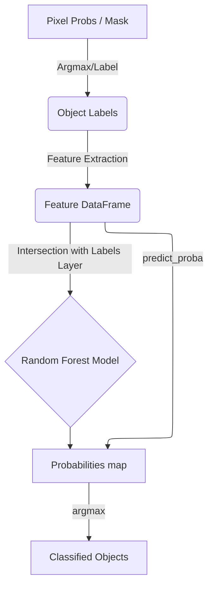

# Architecture

The **object-rf** plugin is structured into three main modules: GUI, Feature Extraction, and Classification.

## Core Modules

### 1. `ObjectWidget` (`src/object_rf/_widget.py`)

- Manages the state and user interactions via `image_states`.
- Integrates with napari's layers to fetch data.
- Orchestrates asynchronous workflows using `napari.qt.threading.thread_worker`.
- Implements a memory-efficient "Create -> Predict -> Discard" loop for 3D stacks.

### 2. `FeatureExtractor` (`src/object_rf/feature_extraction.py`)

- Implements slice-by-slice feature extraction for both 2D and 3D data.
- Performs 0.5-99.5% intensity clipping for robust normalization.
- Generates a rich feature set including geometry (Log Area, Eccentricity, Circularity, Log Hu Moments) and multi-layer intensity statistics (Raw, Sobel, Frangi).

### 3. `ObjectClassifier` (`src/object_rf/classifier.py`)

- A wrapper around `sklearn.ensemble.RandomForestClassifier`.
- Optimized to use `predict_proba` for single-pass inference of both class labels and probabilities.

## Data Flow Diagram

## Segmentation Pipeline

To ensure high-quality object classification, `object-rf` uses a robust, multi-step pipeline to segment objects from pixel-level predictions (from `napari-rf`):

1. **Probability to Mask (`argmax`)**:
    - Probability stacks from `napari-rf` are converted to class maps.
    - Foreground is defined as any pixel with a class ID > 0.
2. **Morphological Pre-processing**:
    - `binary_fill_holes` is applied slice-by-slice.
3. **Initial Object Labeling**:
    - `skimage.measure.label` generates unique integer IDs.
4. **Automated Size Filtering (Noise Removal)**:
    - **Trigger**: Only runs if objects with area $\le 10$ pixels are detected.
    - **Log-Transformation**: Areas are converted to `log10` space.
    - **Clustering (K-Means)**: Separates objects into "Noise" and "Signal" populations.
    - **Optimization (SVM)**: Finds the optimal decision boundary between the two clusters.
5. **Dilation**:
    - Remaining objects are dilated (Radius 1) to capture full intensity boundaries.
6. **Sequential Relabeling**:
    - Ensures label IDs are continuous (1 to $N$).

## Memory-Efficient 3D Workflow

To handle large 3D stacks without exhausting RAM, `object-rf` uses a transient feature processing strategy:

1. **Training**: Features are extracted *only* for objects in slices containing user annotations.
2. **Inference (Apply RF)**: The plugin iterates through the stack slice-by-slice. For each slice, it extracts features, predicts probabilities, "paints" them into the dense output buffer, and immediately discards the feature DataFrame.

## Feature Engineering Pipeline

Objects are characterized by a combination of shape and internal texture derived from three image layers:

- **Geometry (Label Mask)**: Log Area, Eccentricity, Circularity, and 7 Log-Hu Moments.
- **Intensity (Raw Image)**: First-order statistics (Mean, Var, Skew, Kurtosis) and a 10-bin normalized histogram.
- **Edge Texture (Sobel Filter)**: Highlights sharp intensity transitions (e.g., chromatin granularity).
- **Tubular Texture (Frangi Filter)**: Highlights ridge-like structures (e.g., internal filaments or hyphal infection).
