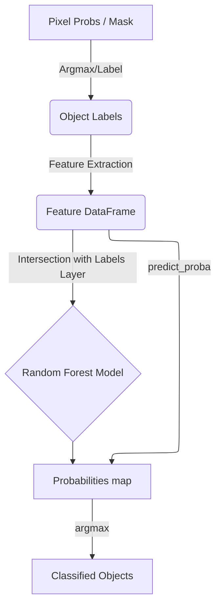

# Architecture

The **object-rf** plugin is structured into three main modules: GUI, Feature Extraction, and Classification.

## Core Modules

### 1. The Orchestrator (`src/object_rf/_widget.py`)
- Acts as the central hub connecting UI signals to state management and background thread workers.
- Delegates heavy logic to specific modules rather than implementing algorithms directly.

### 2. State Management (`src/object_rf/state.py`)
- **`ImageStateManager`**: Centralized tracking of `Image` and `Labels` layers, their metadata (shapes, paths, original dimensionality), and cached features/probabilities.

### 3. Asynchronous Workers (`src/object_rf/workers.py`)
- Contains pure Python functions and generators for computationally heavy tasks: segmentation, random forest training, and full-stack predictions.
- Fully decoupled from `napari.viewer` and Qt GUI updates.

### 4. UI Components (`src/object_rf/components/`)
- A modular collection of QWidgets breaking down the interface: `LayerSelectionWidget`, `ActionButtonsWidget`, `ClassifierControlsWidget`, and `IOControlsWidget`.

### 5. `FeatureExtractor` & `ObjectClassifier`
- **`FeatureExtractor`**: Slice-by-slice 0.5-99.5% normalized multi-layer feature extraction (Geometry, Intensity, Texture).
- **`ObjectClassifier`**: Wrapper around `RandomForestClassifier` optimized for `predict_proba` single-pass inference.

## Data Flow Diagram

## Segmentation Pipeline

To ensure high-quality object classification, `object-rf` uses a robust, multi-step pipeline to segment objects from pixel-level predictions (from `napari-rf`):

1. **Probability to Mask (`argmax`)**:
    - Probability stacks from `napari-rf` are converted to class maps.
    - Foreground is defined as any pixel with a class ID > 0.
2. **Morphological Pre-processing**:
    - `binary_fill_holes` is applied slice-by-slice.
3. **Initial Object Labeling**:
    - `skimage.measure.label` generates unique integer IDs.
4. **Automated Size Filtering (Noise Removal)**:
    - **Trigger**: Only runs if objects with area $\le 10$ pixels are detected.
    - **Log-Transformation**: Areas are converted to `log10` space.
    - **Clustering (K-Means)**: Separates objects into "Noise" and "Signal" populations.
    - **Optimization (SVM)**: Finds the optimal decision boundary between the two clusters.
5. **Dilation**:
    - Remaining objects are dilated (Radius 1) to capture full intensity boundaries.
6. **Sequential Relabeling**:
    - Ensures label IDs are continuous (1 to $N$).

## Memory Optimization & Caching

To handle high-resolution 3D stacks without exhausting system RAM, `object-rf` employs several aggressive memory-saving design choices.

### 1. Hybrid Feature Caching
Feature extraction is the most computationally expensive and memory-intensive part of the pipeline. The plugin manages this via a dual-cache system:

-   **Training Cache (`training_features`)**: When you train the model, features are extracted **only** for slices containing manual annotations. These are stored in a persistent DataFrame within the `image_states` dictionary.
-   **Inference Loop**: When applying the model to a full 3D stack:
    -   The plugin iterates through the stack slice-by-slice.
    -   If a slice was previously processed during training, the plugin **reuses** the cached features from `training_features`.
    -   If the slice is new, features are generated on the fly, used for prediction, and immediately **discarded** from RAM.
-   **Last-Slice Buffer**: Only the features for the *most recently processed slice* are kept in `prediction_features` to allow for quick re-application if parameters change slightly.

### 2. State-Based Data Management
Instead of duplicating large arrays across the Napari viewer and internal logic, `object-rf` uses a centralized `image_states` dictionary:
-   **Reference Tracking**: It stores references to active layers and their source paths.
-   **On-Demand Clearing**: When a user switches to a new image in the dropdown, the plugin detects if large feature or probability caches exist for the previous image and prompts the user to clear them.

### 3. Dual-Format Probability Pipeline
Storing both a 4D probability map (`float32`) and a 3D class map (`uint8`) for a large stack doubles the spatial memory footprint.
-   **In-Memory**: Only the probability map is stored in the state.
-   **On-the-Fly Derivation**: The integer class map is calculated using a vectorized `argmax` operation only when needed for display or export, significantly reducing persistent RAM usage.

## Feature Matrix Structure

The cached feature matrix (`training_features`) is stored as a **Pandas DataFrame** with the following structure:

### Rows (Instances)
- Each row represents a **unique object-slice pair**.
- For 2D images, there is one row per segmented object.
- For 3D images, a single 3D object that spans multiple slices is represented as **independent 2D instances** (one row for every slice it appears in). This allows the classifier to leverage slice-specific local context.

### Columns (69 Total)
| Group | Count | Names / Descriptions |
| :--- | :--- | :--- |
| **Metadata** | 2 | `label`, `slice_id` |
| **Geometry** | 10 | `log_area`, `eccentricity`, `circularity`, `hu_moment_0` to `6` |
| **Intensity (Raw)** | 14 | Mean, Var, Skew, Kurtosis, and 10-bin normalized histogram. |
| **Intensity (Sobel)**| 14 | Edge-enhanced stats and 10-bin histogram. |
| **Intensity (Frangi)**| 14 | Tubular-enhanced stats and 10-bin histogram. |
| **Texture (GLCM)** | 5 | Contrast, Dissimilarity, Homogeneity, Energy, Correlation (averaged across 4 angles). |
| **Texture (LBP)** | 10 | 10-bin Local Binary Pattern histogram (Uniform method, P=8, R=1). |

## Feature Engineering Pipeline

Objects are characterized by a combination of shape and internal texture derived from three image layers:

- **Geometry (Label Mask)**: Log Area, Eccentricity, Circularity, and 7 Log-Hu Moments.
- **Intensity (Raw Image)**: First-order statistics (Mean, Var, Skew, Kurtosis) and a 10-bin normalized histogram.
- **Edge Texture (Sobel Filter)**: Highlights sharp intensity transitions (e.g., chromatin granularity).
- **Tubular Texture (Frangi Filter)**: Highlights ridge-like structures (e.g., internal filaments or hyphal infection).
