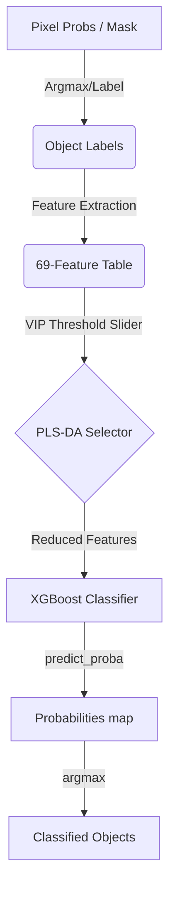

# Architecture

The **object-xgb** plugin is structured into three main modules: GUI, Feature Extraction, and Classification.

## Core Modules

### 1. The Orchestrator (`src/object_xgb/_widget.py`)
- Acts as the central hub connecting UI signals to state management and background thread workers.
- Delegates heavy logic to specific modules rather than implementing algorithms directly.

### 2. State Management (`src/object_xgb/state.py`)
- **`ImageStateManager`**: Centralized tracking of `Image` and `Labels` layers, their metadata (shapes, paths, original dimensionality), and cached features/probabilities.

### 3. Asynchronous Workers (`src/object_xgb/workers.py`)
- Contains pure Python functions and generators for computationally heavy tasks: segmentation, PLS-DA + XGBoost training, and full-stack predictions.
- **Optimized Prediction**: Uses the `selected_features` list from the classifier to gate the `FeatureExtractor`, avoiding calculation of unneeded feature groups.
- Fully decoupled from `napari.viewer` and Qt GUI updates.

### 4. UI Components (`src/object_xgb/components/`)
- A modular collection of QWidgets: `LayerSelectionWidget`, `ActionButtonsWidget`, `ClassifierControlsWidget` (now with VIP Threshold slider), and `IOControlsWidget`.

### 5. `FeatureExtractor` & `ObjectClassifier`
- **`FeatureExtractor`**: Slice-by-slice 0.5-99.5% normalized multi-layer feature extraction. Always maintains a fixed 69-feature schema via NaN padding.
- **`ObjectClassifier`**: A unified pipeline consisting of:
    - `PairwisePLSFeatureSelector`: Uses VIP scores to filter redundant features.
    - `ObjectXGBoostClassifier`: High-performance classification with automated class-weight balancing.

## Data Flow Diagram

## Segmentation Pipeline

To ensure high-quality object classification, `object-xgb` uses a robust, multi-step pipeline:

1. **Probability to Mask (`argmax`)**:
    - Probability stacks from `napari-rf` are converted to class maps.
    - Foreground is defined as any pixel with a class ID > 0.
2. **Morphological Pre-processing**:
    - `binary_fill_holes` is applied slice-by-slice.
3. **Initial Object Labeling**:
    - `skimage.measure.label` generates unique integer IDs.
4. **Automated Size Filtering (Noise Removal)**:
    - **Trigger**: Only runs if objects with area $\le 10$ pixels are detected.
    - **Log-Transformation**: Areas are converted to `log10` space.
    - **Clustering (K-Means)**: Separates objects into "Noise" and "Signal" populations.
    - **Optimization (SVM)**: Finds the optimal decision boundary between the two clusters.
5. **Dilation**:
    - Remaining objects are dilated (Radius 1) to capture full intensity boundaries.
6. **Sequential Relabeling**:
    - Ensures label IDs are continuous (1 to $N$).

## Memory Optimization & Caching

To handle high-resolution 3D stacks without exhausting system RAM, `object-xgb` employs several aggressive memory-saving design choices.

### 1. Hybrid Feature Caching
Feature extraction is the most computationally expensive and memory-intensive part of the pipeline. The plugin manages this via a dual-cache system:

-   **Training Cache (`training_features`)**: When you train the model, features are extracted **only** for slices containing manual annotations. These are stored in a persistent DataFrame within the `image_states` dictionary.
-   **Inference Loop**: When applying the model to a full 3D stack:
    -   The plugin iterates through the stack slice-by-slice.
    -   If a slice was previously processed during training, the plugin **reuses** the cached features from `training_features`.
    -   If the slice is new, features are generated on the fly, used for prediction, and immediately **discarded** from RAM.
-   **Last-Slice Buffer**: Only the features for the *most recently processed slice* are kept in `prediction_features` to allow for quick re-application if parameters change slightly.

### 2. State-Based Data Management
Instead of duplicating large arrays across the Napari viewer and internal logic, `object-xgb` uses a centralized `image_states` dictionary:
-   **Reference Tracking**: It stores references to active layers and their source paths.
-   **On-Demand Clearing**: When a user switches to a new image in the dropdown, the plugin detects if large feature or probability caches exist for the previous image and prompts the user to clear them.

### 3. Dual-Format Probability Pipeline
Storing both a 4D probability map (`float32`) and a 3D class map (`uint8`) for a large stack doubles the spatial memory footprint.
-   **In-Memory**: Only the probability map is stored in the state.
-   **On-the-Fly Derivation**: The integer class map is calculated using a vectorized `argmax` operation only when needed for display or export, significantly reducing persistent RAM usage.

## Feature Matrix Structure

The feature table is stored as a **Pandas DataFrame** with a fixed schema.

### Rows (Instances)
- Each row represents a **unique object-slice pair**.
- For 2D images, there is one row per segmented object.
- For 3D images, a single 3D object that spans multiple slices is represented as **independent 2D instances** (one row for every slice it appears in). This allows the classifier to leverage slice-specific local context.

### Columns (72 Total)
| Group | Count | Names / Descriptions |
| :--- | :--- | :--- |
| **Metadata** | 3 | `label`, `slice_id`, `true_label` (Ground Truth) |
| **Geometry** | 10 | `log_area`, `eccentricity`, `circularity`, `hu_moment_0` to `6` |
| **Intensity (Raw)** | 14 | Mean, Var, Skew, Kurtosis, and 10-bin normalized histogram. |
| **Intensity (Sobel)**| 14 | Edge-enhanced stats and 10-bin histogram. |
| **Intensity (Frangi)**| 14 | Tubular-enhanced stats and 10-bin histogram. |
| **Texture (GLCM)** | 5 | Contrast, Dissimilarity, Homogeneity, Energy, Correlation. |
| **Texture (LBP)** | 10 | 10-bin Local Binary Pattern histogram (Uniform method). |

## Optimization Strategies

### 1. Group-Aware Feature Extraction
The `FeatureExtractor` uses a dependency-aware logic. If the PLS-DA selector identifies `raw_mean` as important, the extractor calculates the **entire** `intensity_raw` group (mean, variance, and histogram). This ensures the mathematical integrity of the feature space while skipping entirely unrelated groups (like `texture_glcm`) to save time.

### 2. NaN Padding and Schema Consistency
To allow models to be saved and loaded across different images, the feature table always maintains all 69 feature columns. Features that are not calculated (either due to user selection or optimization) are filled with `NaN`. This ensures the XGBoost pipeline always receives a table with the expected shape and column names.
